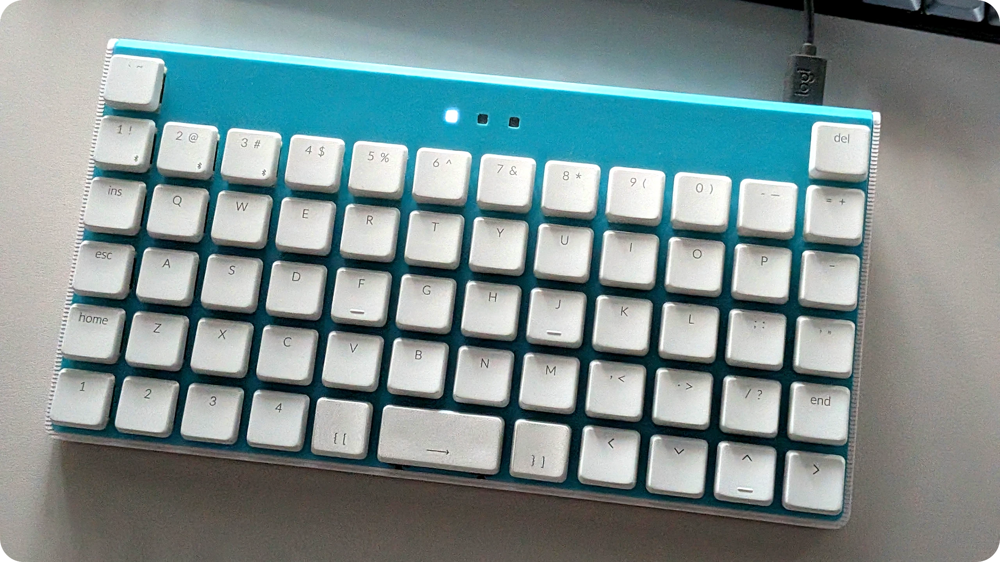
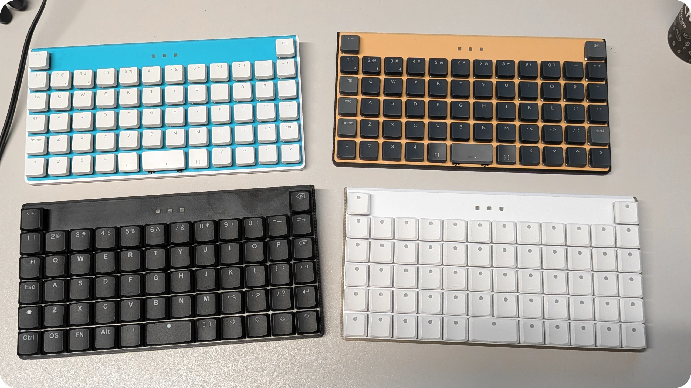

# Krteq

[](#pcb)
[](#case)
[](#firmware)

An extended 5x12 keyboard with 2 extra keys. Intended for ortho layouts with a shifted number row, allowing for the placement of the delete and tilde keys above their usual spots.

Krteq is a successor to [Krtkus](https://github.com/swift502/Krtkus), learning from its lessons to make a design that's easier to build, more maintainable, better encapsulated and overall a more complete product.

### Features

- Low profile
- Hotswap
- RGB backlight
- QMK/VIA compatible
- 3D printed case with a 7 degree tilt
- Tray mount
- 233mm × 121mm × 30mm

Connecting the keyboard to [usevia.app](https://usevia.app) requires manually uploading the [design file](production/krteq_via.json) in the design tab.



## Build guide

### Parts

- [PCB](#pcb)
- [Case](#case)
- Raspberry Pi Pico
- Adafruit style USB-C breakout board
- 128x32 I2C OLED display module
- 61x Gateron KS-33 switches
- 61x MX low profile keycaps
- Gateron 2u low profile plate-mounted stabilizer
- 8x M2.5x6 screws
- Rubber feet

### Breakout boards

Three third party boards are used in the design with varying levels of standardization.

The **OLED display** is the least standardized, so the PCB cutout is very generous to fit modules with slightly different dimensions. Any OLED roughly equal or less than 38x12mm should fit well, and at most require slight modifications to the display cutout in the top plate.

The **USB breakout board** is expected to match the specs of the Adafruit USB-C breakout board with two M2.5 screw holes 15.24mm apart, 2.54mm from the front edge, and built-in resistors for the CC lines.

Finally the **Raspberry Pi Pico**, which we'll be connecting to USB data lines via its test pads.

> [!WARNING]
> TODO IMAGE

### Assembly

#### PCB

- Perform the initial firmware flash on the Pico
- Solder the Pico onto the PCB
- Solder the PCB wire ends to the J1, J2 and J3 interfaces

#### Plate

- Attach the 2u stabilizer to the plate
- Screw the USB breakout to the plate
- Place OLED breakout into plate's display slot

#### Final assembly

- Connect the plate to the PCB by pushing switches through them
- Solder component wire ends to the respective breakout boards
- Screw the top case to the bottom case

Put on some keycaps and it's done!

## PCB

The Kicad 10 project can be found in [source/kicad](source/kicad). All parts are SMD, the PCB is intended to be ordered with pre-assembled SMD components for an easier, although more expensive build process.

To generate fabrication files, open the Kicad project and use an export plugin provided by the PCB manufacturer you want to order from. The order process is then highly dependent on the manufacturer.

### Suggested BOM

| Part | Package | Manufacturer Part Number |
|---|---|---|
| Switch diode | SOD-123 | 1N4148W |
| Switch socket | SMD | KS-2P02B01-02 |
| RGB LED | SMD-4P,3.2x1.3mm | A-SP1513R6GHB1C-A01-2A |
| RGB driver | QFN-48-EP(6x6) | IS31FL3733-QFLS4-TR |
| 0.1µF capacitor | 0402 | CL05B104KO5NNNC |
| 0.47µF capacitor | 0603 | CL10B474KA8NNNC |
| 22µF/10V capacitor | 0805 | CL21A226MAYNNNE |
| 2kΩ resistor | 0603 | 0603WAF2001T5E |
| 20kΩ resistor | 0603 | 0603WAF2002T5E |
| 100kΩ resistor | 0603 | 0603WAF1003T5E |

## Case

Case blend file can be found in [source/Krteq.blend](source/Krteq.blend). It's designed non-destructively, so it should be fairly easy to modify if needed.

STL files for 3D printing can be found in [production/stl](production/stl). Recommended printing parameters are PLA, 0.15mm layer height and 100% infill.

The plate has a "keychron" variant, which adjusts stabilizer cutouts for their non-standard [triangular stem design](https://www.keychron.com/blogs/news/the-design-details-of-our-keychron-low-profile-keyboard-stabilizers).

## Firmware

QMK/VIA setup with a few custom features:

- custom `KRT_VOL` keycode for combined volume control
- custom `KRT_SCR` keycode for OLED mode switching
- pressing <kbd>LShift</kbd> + <kbd>RShift</kbd> + <kbd>B</kbd> enters bootloader mode
- pressing <kbd>LShift</kbd> + <kbd>RShift</kbd> + <kbd>C</kbd> reverts to the default keymap

### Compiling (Windows)

Install:

- Python: https://www.python.org/
- MSYS: https://msys.qmk.fm

Run the compile script:

```sh
python source/scripts/qmk_compile.py
```

### Flashing (Windows)

For the initial flash, hold the BOOTSEL button while connecting the Pico to a computer to have it show up as a storage device, then copy the compiled [firmware file](production/krteq_firmware.uf2) over to it.

Once flashed, you can trigger the bootloader mode again by simply pressing the <kbd>LShift</kbd> + <kbd>RShift</kbd> + <kbd>B</kbd> key combination.

## Documentation

### QMK

- Info.json: https://docs.qmk.fm/reference_info_json
- Keycodes: https://docs.qmk.fm/keycodes
- Default keymap: https://docs.qmk.fm/configurator_default_keymaps
- RGB matrix: https://docs.qmk.fm/features/rgb_matrix
- OLED: https://docs.qmk.fm/features/oled_driver

### Kicad

Switch grid reference table:

| Grid | Size |
| --- | --- |
| Switch 1 | 19.05 |
| Switch 1/4 | 4.7625 |
| Switch 1/16 | 1.190625 |
| Switch 1/32 | 0.5953125 |
| Switch 1/64 | 0.29765625 |